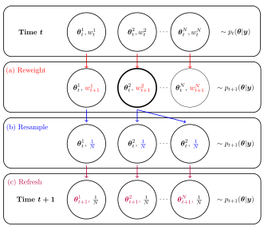

class: list-space

<style>

.list-space li {
padding: 0.25cm;
}

.list-nobullet li {
  list-style-type:none;
}

</style>


```{r setup, load_refs, include=FALSE, cache=FALSE}
library(ggplot2)
library(dplyr)
library(tidyr)
library(scales)
library(RColorBrewer)
library(kableExtra)
library(purrr)

library(RefManageR)
BibOptions(check.entries = FALSE,
           bib.style = "authoryear",
           cite.style = "authoryear",
           style = "html",
           hyperlink = FALSE,
           dashed = FALSE)
myBib <- ReadBib("biblio.bib", check = FALSE)

#### Helpers ####
capitalize <- function(string) {
  substr(string, 1, 1) <- toupper(substr(string, 1, 1))
  string
}

attach_name <- function(string, name){
  paste(name, "=", capitalize(string))
}

label_alg <- Vectorize(function(x){
  
  switch(x,
         smc_standard = "Standard",
         smc_da =  "DA+T",
         smc_da_no_trans = "DA",
         smc_sfa_da = "DA+T+SFA",
         smc_sfa_da_no_trans = "DA+SFA",
         smc_sfa = "SFA",
         smc_approx = "Approx"
         )
  
})

cr_label <- trans_format('log10', math_format(10^.x))

parse_labels <- function(values) {
  #values <- paste0("list(", values, ")")
  values <- gsub("`","", values)
  lapply(values, function(expr) c(parse(text = expr)))
}

flabeller <- labeller(likelihood = function(s) capitalize(s),
                      bss_model = function(s) attach_name(s, "Tuning"),
                      alg = function(s) label_alg(s),
                      cost_ratio = label_parsed,
                      iter_group = label_parsed,
                      beta = label_parsed
                      )

scientific_10 <- function(x, remove_1_times = F) {
  exp_text <- ifelse(x > 1,
         gsub("e\\+", " %*% 10^", scales::scientific_format()(x)),
         gsub("e", " %*% 10^", scales::scientific_format()(x))
  )
  
  if(remove_1_times){
    
    exp_text <- gsub("1 %*% ", "", exp_text, fixed = T)
    
  }

  parse(text = exp_text)
  
}

algs_list_sort <- c("smc_standard", 
                    "smc_da", "smc_da_no_trans", 
                    "smc_sfa_da", "smc_sfa_da_no_trans", 
                    "smc_sfa", "smc_approx")

algs_list_names <- c("Standard", 
                     "DA+T", "DA", 
                     "DA+T+SFA", "DA+SFA", 
                     "SFA", "Approx")

facet_label_scientific_rho <- function(x, rv = T){
  
  levels <- unique(x)
  labels <- ifelse(levels > 1,
                   gsub("e\\+", " %*% 10^", scales::scientific_format()(levels)),
                   gsub("e", " %*% 10^", scales::scientific_format()(levels))
  )
  
  labels <- paste("rho ==", gsub("1 %*% ", "", labels, fixed = T))
  
  if(rv){
    ordered(x, levels = rev(levels), labels = rev(labels))
  } else {
    ordered(x, levels = levels, labels = labels)
  }
}

facet_label_gamma <-  function(x){
  
  levels <- c("(0,3]", "(3,6]", "(6,9]", "(9,Inf]")
  new_labs <- c("group('{',list(1,2,3),'}')", 
                "group('{',list(4,5,6),'}')", 
                "group('{',list(7,8,ldots),'}')",
                "group('{',list(7,8,ldots),'}')")
  
  labels <- paste("gamma ==", new_labs)
  
  ordered(x, 
         levels = levels,
         labels = labels
  )
  
}

knitr::opts_chunk$set(cache = T)

# TODO: result of whittle, andrews comments

```

## Details

Joint work with
- **Anthony Lee** (Bristol University), and
- **Christopher Drovandi** (QUT)

.pull-left[

```{r qr-arxiv, echo=FALSE, eval=TRUE, fig.aign='center', out.width= 200}

```

ArXiv: https://arxiv.org/abs/2009.03699

]

.pull-right[

```{r qr-slides, echo=FALSE, eval=TRUE, fig.aign='center', out.width= 200}

```

Slides: https://bonstats.github.io/isba-da-smc/
]


---
class: inverse, center, middle, hide-logo

# How can a surrogate likelihood be exploited for computational gains in SMC? 


---
class: hide-logo

Example SMC algorithm: Resample-move for static models
```{r smc-alg, echo=FALSE, eval=TRUE, fig.align='center', out.width= 650}

```

---
class: list-space
## Recap

Three strategies within sequential Monte Carlo:

1. **Delayed-acceptance**
    - Optimise tuning parameters: balance cost vs diversity
    - Tune with pilot run of mutation step
2. **Surrogate likelihood calibration**
    - Transform surrogate likelihood to better match full likelihood
    - Uses history of particles
3. **Surrogate first annealing**
    - Change sequence of distributions with surrogate posterior as intermediate distribution
    - Quickly move to high probability regions without using full likelihood


---
## Optimising computation time in **Delayed-acceptance**
  
Solve the following approximately

$$\arg \min_{\boldsymbol{\phi}} C(k,\boldsymbol{\phi})$$
$$\text{such that } D(k,\boldsymbol{\phi}) > d$$
$$~$$

--
  
**Diversification criterion**: use median ESJD to determine number of cycles required 
([Pasarica and Gelman, 2010;](www.jstor.org/stable/24308995) [Salomone et al, 2018](https://arxiv.org/abs/1805.03924)).

.full-width[.content-box-red[
  $$D(k,\boldsymbol{\phi}) = \text{median}\left\{\sum_{s=1}^{k} J_{s}(\boldsymbol{\phi}) \right\}$$
]]

- $k$: Cycles of DA kernel
- $J_{s}(\boldsymbol{\phi})$: ESJD in cycle $s$ with parameter $\boldsymbol{\phi}$

---
  
## Calibrating the surrogate likelihood
  
.full-width[.content-box-red[
    **Key idea**: Use current location or location history of the particles to calibrate the surrogate likelihood (better match the full likelihood).
]]

--
  
**1. Location-scale transformation**
  
Take $T_{\boldsymbol{\xi}}$, a pre-specified transformation with parameters $\boldsymbol{\xi}$ and find

$$\boldsymbol{\xi}^{\star} = \min_{\boldsymbol{\xi}} \sum_{\boldsymbol{\theta} \in H(L)}d\left[ L(\boldsymbol{y}~\vert~\boldsymbol{\theta}), \tilde{L}(\boldsymbol{y}~\vert~T_{\boldsymbol{\xi}}(\boldsymbol{\theta}))\right]$$
--

**2. Weighted annealing**
  
For surrogate likelihoods that can be factorised let $\tilde{L}(\boldsymbol{y}~\vert~\boldsymbol{\theta},\boldsymbol{\omega}) = \prod_{i=1}^{n} \tilde{p}(y_{i}~\vert~\boldsymbol{\theta})^{\omega_{i}}$ and find 

$$\boldsymbol{\omega}^{\star} = \min_{\boldsymbol{\omega}} \sum_{\boldsymbol{\theta} \in H(L)}d\left[ L(\boldsymbol{y}~\vert~\boldsymbol{\theta}), \tilde{L}(\boldsymbol{y}~\vert~\boldsymbol{\theta}, \boldsymbol{\omega})\right] + \lambda \Vert\boldsymbol{\omega}\Vert_{1}$$
---
## Surrogate first annealing
  
.full-width[.content-box-red[
    **Key idea**:
      Use two stages of annealing in SMC to eliminate unlikely particles early with low cost.
]]

--
  
  $$p_{0}(\boldsymbol{\theta}) \rightarrow \tilde{p}(\boldsymbol{\theta}~\vert~\boldsymbol{y})^{\lambda} \rightarrow p(\boldsymbol{\theta}~\vert~\boldsymbol{y}), \quad 0 < \lambda \leq 1$$
  
--
  
  | $\gamma_{t}\qquad$ | $p_{t}(\boldsymbol{\theta})$ |
  |--------------------------------------|----------------|
  | 0.0 | $p_{0}(\boldsymbol{\theta})$ |
  | 0.5 | $p_{0}(\boldsymbol{\theta})^{0.5}\tilde{p}(\boldsymbol{\theta}~\vert~\boldsymbol{y})^{0.5\lambda}$ |
  | 1.0 | $\tilde{p}(\boldsymbol{\theta}~\vert~\boldsymbol{y})^{\lambda}$ |
  | 1.5 | $\tilde{p}(\boldsymbol{\theta}~\vert~\boldsymbol{y})^{0.5\lambda} p(\boldsymbol{\theta}~\vert~\boldsymbol{y})^{0.5}$ |
  |  2.0 | $p(\boldsymbol{\theta}~\vert~\boldsymbol{y})$ |
  
---
class: list-space

## Overview of Results

- Simulation study
   - speeding up SMC by $2.9\times$ to $8.8\times$ compared to standard SMC. 
   - better improvements for larger ratio of full to surrogate likelihood cost

--
- Using all innovations had super-linear performance compared to just one or two.

--
- Whittle likelihood example
  - $3.9\times$ to $5.8\times$ speed-up across the 10 simulations (80% interval)
  - Reduced computation time from $\approx$ 20.5 hours to 4.5 hours

---

## Posterior Comparisons - Whittle

```{r whittle-plot-post-comp, eval = T, echo = F, out.width='65%', }

pdfcvt <- "plots/whittle-phi2-2020-09-06"

cvt <- F

if(cvt){
  
  pdftools::pdf_convert(pdf = paste0(pdfcvt,".pdf"), format = "png", dpi = 72*3,
                        filenames = paste0(pdfcvt,".png"))
}

knitr::include_graphics(paste0(pdfcvt,".png"))
```

---
class: list-space

## Conclusions

--

- A generic framework for tuning mutation kernels in SMC

    - Choosing optimal kernel tuning parameters and number of cycles
    - Ensure sufficient particle diversification adaptively

--

- Explored uses of surrogate likelihoods in SMC

    - Delayed-acceptance
    - Surrogate first annealing

--

- Adaptively improves surrogate likelihoods

    - With surrogate likelihood calibration

---
## Thank you for watching

.pull-left[

```{r qr-arxiv2, echo=FALSE, eval=TRUE, fig.aign='center', out.width= 200}

```

ArXiv: https://arxiv.org/abs/2009.03699

]

.pull-right[

```{r qr-slides2, echo=FALSE, eval=TRUE, fig.aign='center', out.width= 200}

```

Slides: https://bonstats.github.io/isba-da-smc/
]

